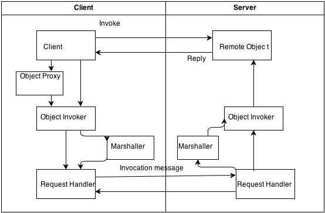

Sodacloud Documentation
=========

Overview of SodaCloud
------------
SodaCloud is a shared object distribution architecture for cloud systems. 
SodaCloud provides a platform that automatically creates mobile/cloud applications with optimized communications,
cloud-based data sharding, cyber-physical information usage (e.g. geo-located data), 
and code generation / testing methods for ensuring platform correctness. 

Using SodaCloud, the developer will be able to build a model of the client/server services, data, and 
security requirements and automatically generate an entire system backbone. The backbone will allow developers 
to enter key system logic manually, while the backbone will take care of client/cloud communications, 
automatic platform instrumentation and replay of request data for QA, data marshaling infrastructure, 
and capture of key performance / cloud resource sizing data to aid in resource allocation decisions and 
operations cost optimization.



SodaCloud supports automatic creation of cloud mobile client to cloud server communication infrastructure,
including data marshaling mechanisms, that alleviate the need for developers to hand-code complex 
asynchronous communication pathways and optimize underlying protocols for the target API. 

SodaCloud is built on top of an HTTP + push messaging communication system. HTTP is the most widely used mobile 
communications protocol and leveraged by key apps, such as Facebook, LinkedIn, etc. A key challenge with HTTP-based 
communication from apps is the API-boundaries that transition from traditional OO-based programming to high-latency, 
non-OO, request-response style communication. SodaCloud builds an OO-based abstraction on top of this communication 
pathway to hide these complexities from developers and simplify testing. 

Moreover, when using HTTP-based communication approaches, they are biased towards client-initiated communication
and make server-to-device pushing of data challenging. Other mechanisms for pushing data to devices, 
such as Android’s C2DM push messaging are available, but they required complex authentication and negotiation 
between both the client and server and the server and third-party messaging servers. Further, these push notification
systems have multiple asynchronous operations that must complete and state management requirements that 
add another layer of complexity on communications. SodaCloud provides a seamless abstraction
on top of both HTTP and these push messaging mechanisms to provide simplified two-way client/server interaction 
initiation.


A simple example with the Observer pattern 
------------

In the following example, we will use the object “MaintenanceReport” for illustration. In a simple user scenario, the user wants to add a new report in the client side and the server side needs to handle this.

- In Java server-side: a MaintenancesListener interface is declared. Two method is defined for the interface to handle
the add and change event of th report.

```java
public interface MaintenanceListener {
	@SodaAsync
	public void reportAdded(MaintenanceReport r);
	@SodaAsync
	public void reportchanged(MaintenanceReport r);
}
```
A manager class “MaintenanceReports” is declared. It stores the reports and listeners for the reports in lists. When a new
report is uploaded, it will be added to the list of report and all the listeners will be notified.
  
```java  
public class MaintenanceReportsImpl implements MaintenanceReports {
	private List<MaintenanceListener> listeners_ = new LinkedList<MaintenanceListener>();
	private List<MaintenanceReport> reports_ = new LinkedList<MaintenanceReport>();
	@Override
	public void addReport(MaintenanceReport r) {
		reports_.add(r);
		for (MaintenanceListener l : listeners_) {
			l.reportAdded(r);
		}
	}
	……
	@Override
	public void addListener(MaintenanceListener l) {
		listeners_.add(l);
	}
	……
}
```

- In Java client-side (Android), AndroidSoda.async() is the method to call when you need to invoke 
network connection with server. A new thread will be created. The reportHandle is fetched from server using SVC naming service.
A listener is implemented and then added to the handle. Remember to annotate with @SodaInvokeInUi if you try to make any 
changes to UI elements. In the end, addReport() method is called to add the new report to the server.


```java  
AndroidSoda.async(new Runnable() {
	@Override
	public void run() {
		MaintenanceReports reportHandle = as.get(MaintenanceReports.class, MaintenanceReports.SVC_NAME);
		reportHandle.addListener(new MaintenanceListener() {
			@SodaInvokeInUi
			public void reportAdded(final MaintenanceReport r) {
				Toast.makeText(CreateReportFragment.this.getActivity(),"New report:" + r.getContents(),
						Toast.LENGTH_SHORT).show();
			}
			@Override
			public void reportchanged(final MaintenanceReport r) {
			}
		});
		reportHandle.addReport(r);
	}
}
```
- Javascript client-side

Overview of supported platforms
------------
Android, Javascript, iOS.

Setting up a Java server-side project
------------
1. ownload SodaCloud and SodaCloudJetty project.

2. Create a Java project in eclipse and add SodaCloud and SodaCloudJetty to the build path.

3. To create a basic server with Jetty. Create the main class implements ServerSodaListener interface.

```java 
   public class Server implements ServerSodaListener {
    	public static void main(String[] args) {
		      ServerSodaLauncher launcher = new ServerSodaLauncher();
		      launcher.launch(new NativeJavaProtocol(), 8081, new Server());
	    }
      @Override
    	public void started(Soda soda) {
	  }
}
```
4. Defining interfaces for remoteable objects

Here we define the manage interface “MaintenanceReports”

```java
public interface MaintenanceReports {
		public static final String SVC_NAME = "maintenance";
		public void addReport(MaintenanceReport r);
		public void modifyReport(MaintenanceReport r);
	  public void deleteReport(UUID id);
……
}
```
5. How to bind objects

To bind an object, call the function soda.bind(object, SVC_NAME); Where the first parameter is the object to be bind and the second parameter is the String of its SVC name.

```java
soda.bind(reports, MaintenanceReports.SVC_NAME);
```
6. How dynamic proxies are created

After the call of soda.bind(), the proxies of the object are created automatically by Soda. The process happens in DefaultNamingService.java.

```java
ObjRef ref = new ObjRef("" + data.get("uri"),type.getName());
obj = (T)proxyFactory_.createProxy(new Class[]{type}, ref);
```

7. NativeJavaProtocol vs. DefaultProtocol configuration

8. Java implementation limitations

a.	In Java, only parameters that are of an interface type can be
passed by reference.

b.	In Java, generic collections are not supported for incoming pass by
value types because Java does not have reified generic types.

Setting up an Android project
------------

1. Importing the Android library project

2. Setting the correct permissions

3. Initializing AndroidSoda and connecting

a)	The activity will need to implement AndroidSodaListener interface and override the connected() method. Then AndroidSoda.init() will call the connected method and return the AndroidSoda object. After that, you can use AndroidSoda for any connection with the server.

```java
   public class MainActivity extends Activity implements AndroidSodaListener {
      private AndroidSoda as_;
      private AndroidSodaListener asl_;
      @Override
	    protected void onCreate(Bundle savedInstanceState) {
				super.onCreate(savedInstanceState);
	       asl_ = this;
          AndroidSoda.init(ctx_, mHost, 8081, asl_);
          @Override
	     public void connected(AndroidSoda s) {
		        this.as_ = s;
      }
}
```

4. Looking up objects on the server with the naming service

To start a query, call AndroidSoda.async() method:

```java
 		AndroidSoda.async(new Runnable() {
		  @Override
		  public void run() {
			    reports_ = as.get(MaintenanceReports.class,MaintenanceReports.SVC_NAME);
      }
    }
```
5. Defining interfaces for remote objects

6. Soda threading architecture

When the AndroidSoda is initialized, a new thread is created. The network operation is conducted in the new thread. A callback is passed as parameter which handles the result of the network communication. The update of UI after network communication is always done on UI thread of Android. This is ensured by using @SodaInvokeInUi annotation.

7. Use of the Soda annotations for interactions with the UI thread

@SodaInvokeInUi
This annotation marks methods that should always be invoked by Soda in the context of the UI thread on Android. 
If you apply this annotation, you cannot invoke any blocking Soda methods (e.g. any Soda methods that are not void and annotated with @SodaAsync) inside of the method or Android will freak out for doing network ops in the gui thread.

8. Use of the Soda annotations for pass by reference and pass by value

@SodaByValue 
This annotation marks classes that should be passed by value rather than object reference.

9. Sharing object refs via QR code

To share an object via QR code, you need to bind the QR code context to the object. SodaQR is created from a QR image and bind to Soda object.

```java
public void bindQRContext(Soda s, MaintenanceReport r) {
		SodaQR qr = SodaQR.create(r.getContents());
		s.bind(r).to(qr);
	}
```
To lookup object based on QR code, use soda.find() method where the first parameter is the class type and second parameter is SodaContext. The returned SodaQuery is passed in to callback for asynchronized running.

```java
SodaQR _objQR = SodaQR.fromImageData(b);
SodaQuery<MaintenanceReport> _objSQ = s.find(MaintenanceReport.class,_objQR);
callback.handle(_objSQ.getList_());
```

10. Android implementation limitations

Setting up a Javascript project
------------
1. Importing soda.js

2. Connecting to the server

3. Looking up objects on the server with the naming service

4. Constructing objects that are remoteable

5. How remote object proxies are created

6. Invoking remote methods and transparent creation of object
references for local objects

7. Rules for pass by value vs. pass by reference (e.g. it has a
function as a attribute)

8. Javascript implementation limitations

a)	In Javascript, all objects with a function are automatically passed
by reference.

b)	In Javascript, pass by reference is only supported for top-level
method parameters. If a pass by value object is provided to a method,
deep introspection will NOT be used to find and convert embedded
objects to ObjRefs.


Setting up an Objective-C project
------------

1. Adding SodaCloud to your XCode project

2. no-arc and other build settings with cocoapods

3. Initializing Soda

```
    Soda* soda = [[Soda alloc]init];
    [soda connect:host withListener:self];
```    
4. Defining interfaces for remotable objects with SODA_METHODS macros

Obj-C doesn't support runtime introspection of method parameter types,
so several macros are created to capture this info:
This defines a remote object's methods and says it has one method with
a void return type, called addListener, that takes an ObjRef to a
MaintenanceListener.
```
@interface MaintenanceReports : NSObject<SodaObject>
-(void)addListener:(MaintenanceListener*)listener;
@end
@implementation MaintenanceReports
    SODA_METHODS(
             SODA_VOID_METHOD(@"addListener",REF(MaintenanceListener))
    )
@end
```
5. Rules for pass by reference vs pass by value with REF(...)

6. Looking up remote objects with the naming service

```
id obj = [soda.namingService get:@"maintenance" asType:[MaintenanceReports class]];
```
7. Soda threading architecture with Grand Central Dispatch

8.How NSProxies are created

[](https://buildhive.cloudbees.com/job/VT-Magnum-Research/job/sodacloud/)
